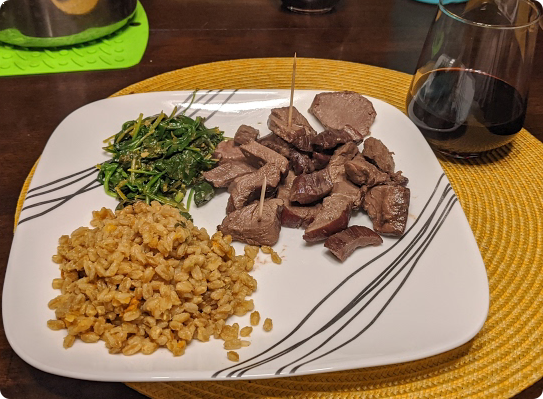

# Garlic Venison Chiclets

## Overview
Prep Time: 5m (Besides thawing meat)

Cook Time: 10m

Effort: 1/10
Taste: 6/10

## Ingredients

- Thawed Venison Steak(s)
    - Frozen steaks can be quickly thawed in water at 120F
    - Tenderloin, or loin steaks are going to generally be better for the relatively large piece sizes.
- Garlic Powder
- Salt
- Oil
- Other seasonings to taste
    - Rosemary
    - Thyme
    - Chipotle Powder
    - etc

## Instructions

1. \[Optional\] Slow cook the steaks either with a sous vide or rubbed in oil and smoked until the internal temp is <110F
2. Dice the steak into bite-sized pieces.
3. Heat oil in the bottom of a frying pan or cast-iron pan on medium heat.
4. Place the steak bites into the oil and cover with salt and garlic powder.
5. Stir the pieces for ~5 minutes, a few more minutes if optional step1 was not followed.
6. Remove from heat and serve with appropriate sides.

