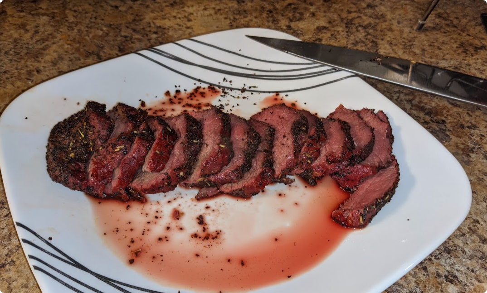
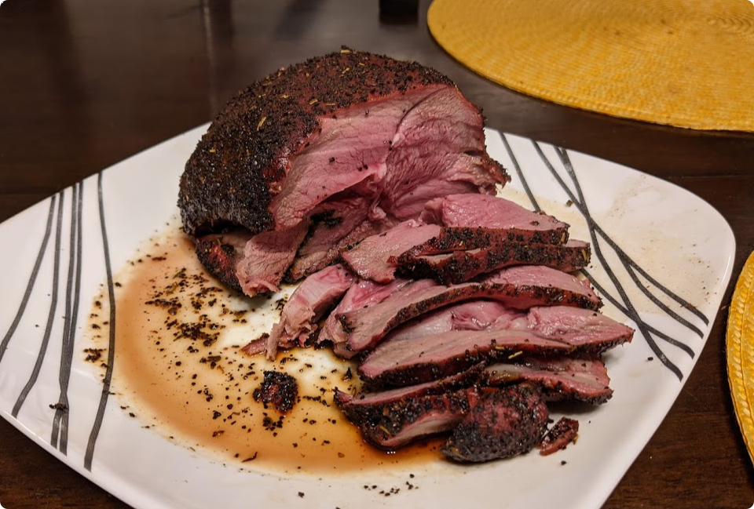

# Smoked Venison Steak or Roast

## Overview
Prep Time: 5m (Besides thawing meat)

Cook Time: 1-2h

Effort: 3/10
Taste: 9/10 - This is my go-to.

## Ingredients

- Thawed Venison Steak(s) / Roast
    - Frozen steaks can be quickly thawed in water at 120F
    - Tenderloin, Loin, Sirloin, or Rounds are all excellent choices for this recipe.
- [Steak Rub](recipes/steak-rub.md)
- Oil (Avocado, or Olive for the rub, Avocado or Grapeseed for frying)

## Instructions

1. Pre-heat your oven / pellet-grill to 150-220F. (The warmer, the quicker the steak will get up to temperature.)
1. Coat the pieces of steak with oil
1. With one hand, sprinkle the steak rub on the meat. Rub into the meat with the other hand.
1. Place the steak in a grill pan (if using an oven) or straight on the grill.
1. \[Optional, testing needed\] Mist the steak with a spray bottle filled with a low-concentraiton (glucose) water. 
    - This has been recommended by a food scientist to create a better flavor when reacting with the smoke. Theoretically it will create more of a crust on the meat through caramelization of the sugar, as well as increase thermophoresis.  
1. Grill / bake until the internal temperature is ~120F
1. Take off the grill / oven.
1. To sear the steak, heat up a cast iron pan, frying pan, or **pellet grill**.
    - Turn the pellet grill to the max temp (Mine is 550F)
    - If using a frying pan or cast iron, heat up oil in the pan to ~350. Avocado or Grapeseed oil works best at higher temperatures.
    - Grill or fry the steak to sear it and raise the internal temperature to ~130-140. This is generally 3-5 minutes.
1. \[Optional, Recommended\] Take off the heat, and let rest for 5-10 minutes.
1. Thinly slice the steak. As thin as possible. 1/8" (3mm) is ideal. The thinner you slice, the more tender and easy to chew the steak will be.
1. Serve immediately while warm. The steak will cool quickly once cut.
