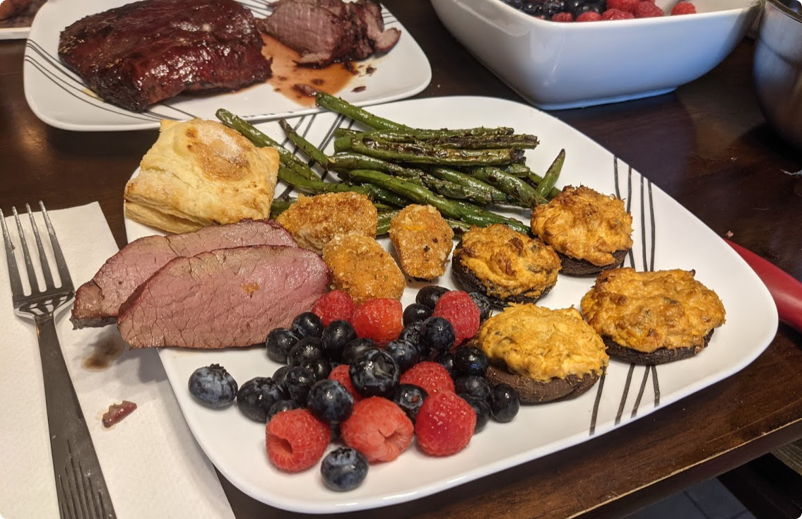

# Cranberry Roast

## Overview
Prep Time: 5m (Besides thawing meat)

Cook Time: 2-4h

Effort: 5/10
Taste: 9/10

## Ingredients

- Thawed Venison Steak(s) / Roast
    - Frozen steaks can be quickly thawed in water at 120F
    - Tenderloin, Loin, Sirloin, or Rounds are all excellent choices for this recipe.
- Cranberry Sauce
    - 2c cranberries
    - 1c diced white onion
    - 2 clove garlic
    - 1c packed light brown sugar
    - 1c red wine vinegar
    - 2c dark ale or lager beer

## Instructions

Cranberry Sauce
1. Combine all ingredients in a blender and blend for a *while*.
1. Place in a saucepan and simmer over medium-low heat stirring occasionally, until the sauce has thickened and reduced slightly. ~1h.
1. With a fine sieve, strain the cranberry particles out of the sauce.

1. Pre-heat your oven / pellet-grill to 220F.
1. Coat the roast with the cranberry sauce using a brush.
1. Smoke until the internal temperature is 120F. Brush on additional cranberry sauce every 15 minutes, and flip the roast.
1. Remove from heat and set the grill to the max temperature. (Mine is 550F)
1. Once the grill is up to temp, place the roast back on. 
1. Brush on additional cranberry sauce every 3-5 minutes until the roast is up to 130F.
1. Remove the roast and let rest for 10 minutes.
1. Thinly slice the roast and serve. 1/8" (3mm) is ideal. The thinner the slices, the more tender the meat will be.
1. Drizzle on some cranberry sauce and down the hatch.

