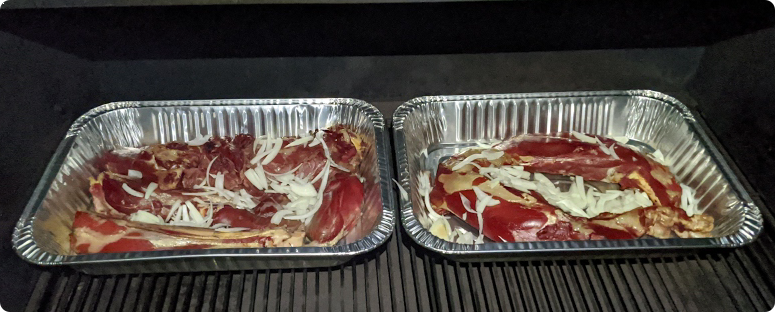

# Pulled Venison

## Overview
Prep Time: 5m

Cook Time: 12-14h

Effort: 5/10
Taste: 9/10

## Ingredients

- Venison (neck meat, shanks, or whole front shoulders. Scrap that would otherwise be ground could be used as well.)
- Water
- \[Optional\] Onion - chopped
- \[Optional\] Garlic or Garlic powder

## Instructions

1. Place the venison in a grill pan, and cover, or mostly cover with water.
1. Place in the oven or pellet grill at 250F for 12-14 hours.
1. Remove from heat, and pull the venison off of the bones.
1. \[Optional\] Pressure can the broth to be used for soup.
1. Vacuum seal or Serve:
    - Pulled venison + BBQ sauce on a sandwich.
    - Pulled venison + Frying in some oil with seasoning for taco meat.
    - Pulled venison + Chips, salsa, and cheese for some delicious nachos.