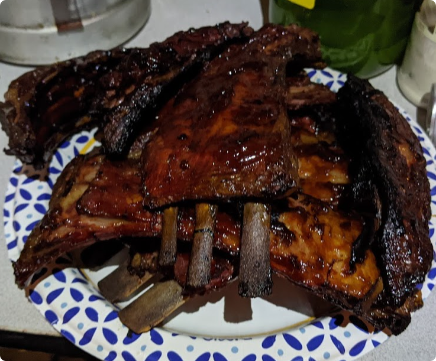

# Venison Ribs

## Overview
Prep Time: n/a

Cook Time: 7h

Effort: 7/10
Taste: 9/10

## Ingredients

- Venison Ribs
    - Make sure to avoid the tallow-full short ribs
- BBQ Sauce (Stubs Mesquite is my favorite)
- Water

## Instructions

1. Braze the ribs for 6 hours. (Cover with water on a grill pan, or dutch oven. Bake at 250 for ~6 hours, until the ribs are not quite 'fall off the bone' tender.)
1. Set the grill to ~350-400F
1. Remove from the brazing water, and place on the grill 'inside' up. Baste with BBQ sauce.
1. Flip, and coat the 'outside' of the ribs every 2-5 minutes 2-3 times.
1. Down the hatch.