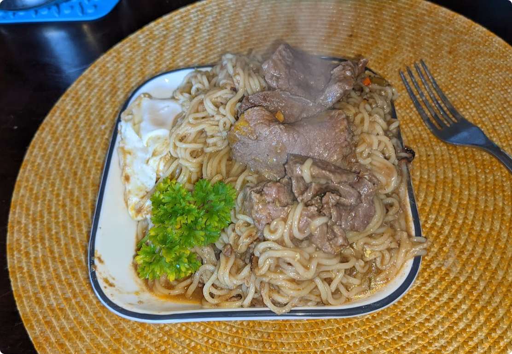

# Venison Ramen

Don't worry, it tasted significantly better than it presents.

## Overview
Prep Time: 5m

Cook Time: 10m

Effort: 1/10
Taste: 5/10

## Ingredients

- Your favorite ramen
- Thin-sliced venison steak (Loin is excellent.)

## Instructions

1. Make the ramen as normal.
1. \[Optional\] Add an egg to the ramen.
1. Once the ramen (and egg) is cooked, remove from heat and add the thinly sliced venison.
1. Down the hatch.
