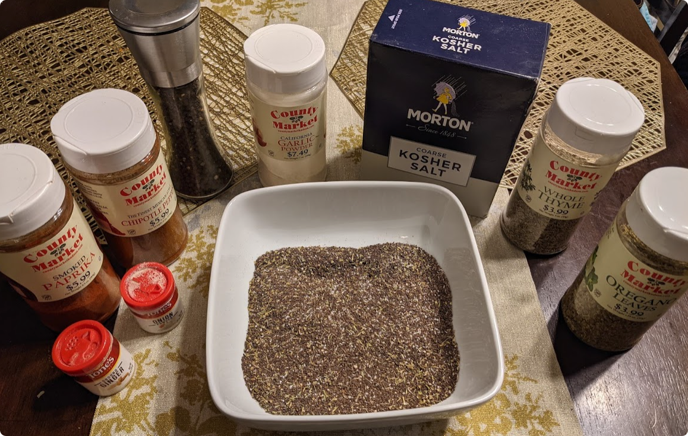

# General-purpose Steak / Roast Rub

This rub has been a success from roasts or steaks in an oven, to fried steaks, to slow-smoked steaks. It is my go-to rub with slight variations depending on the audience.

All proportions have been measured once, but I generally eyeball proportions and each time I make it, it's different.

## Ingredients
- 1/2c ground coffee (Jamaican or Hazelnut flavored coffee is nice)
- 3-4tbs kosher salt (Regular salt can be used, but the larger kosher crystals stick better)
- 1tbs oregano
- 1tbs thyme and / or rosemary
- 1tbs garlic powder
- 1/4tsp onion powder
- 'Spicy' Ingredients
    - 2-6tbs coarse ground black pepper
        - A coffee grinder works well for grinding a lot of black pepper.
    - 1tbs chipotle pepper 
        - (The country market chipotle pepper is less spicy than the small McCormick 'Chipotle Chile Pepper'.)
    - 1/4tsp ground ginger
    
## Instructions

1. Mix all of the ingredients.
2. Store the mixed ingredients.
    - A zip-lock bag works well for this.